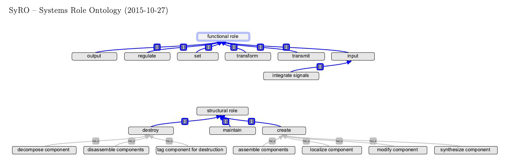

# biologicalsystem

2015 BCH441 project.

## Task

*Adapted (heavily) from [Bioinformatics Project: Defining a System][project-page]*

[project-page]: http://steipe.biochemistry.utoronto.ca/abc/index.php/BIO_project#Second_stage:_Compiling_a_list_of_genes_.2812_marks_max..29

**Identify a defined biological "system" - a set of genes that collaborate
towards a shared purpose**.

Gene Ontology ([GO][GO])
* biological processes
* related processes
* functions
* cellular components

[GO]: http://geneontology.org/

Why GO is not enough? Need human intuition to develop a systems definition
based on GO info - more aspects to a system than *just function*:
* genes that are responsible for substrate import
* biosynthesis of cofactors
* signalling
* regulation
* constructiong scaffolds
* *etc.*

Some genes may play a central role in this process, but provide that role to
other systems as well (e.g. membrane transporters).

Try to: **define inclusion/exclusion criteria**

Most valuable outcome: **how you will address the task of defining system
boundaries**

In practice you should:
* define the biological process you are interested in
* collect all contributing genes as best you can, using a broad spectrum of
  literature comments and bioinformatics tools that we may have or have not
  covered in the course
* develop unambiguous criteria for including or not including such genes in your
  system
* provide an annotated list of included genes, and ones that you have excluded
* carefully document your efforts and results: the datasources, what procedures
  have been applied, how the results have been accessed, validated and
  interpreted

**Aim for 20-30 genes**, to keep things manageable.

When considering how many genes are associated with a system, check the taxon
section of the relevant GO terms' statistic on QuickGO. The number of genes
involved in the process in humans is likely as large as the largest number for
*any* species - although many of the human genes may not have been annotated for
that process (yet). For example, if *mus musculus* has 20 annotated genes and
humans have only two, that probably does not mean humans can achieve with only
two genes that for which the mouse needs twenty. You will need to **consider
genes individually and attempt "annotation transfer"** between orthologues.

A manageable "subsystem" may implement
* integrating input
* transmitting input signals to their effectors
* regulating the process
* providing resources
* defining setpoints
* assembling/dissassembling the system
* mediating interactions with other systems
* *etc.*

A system exists **because** it improves the organism's fitness function. Cannot
quantify fitness, but we can observe the existence of purifying selection. A
system exists **because** it does something which results in traces of
selection.

* Detail the roles that your system needs to work
* Associate genes with roles

How does the system
* come into existence
* accept substrates and/or information
* how it transforms input
* how output is generated

Consider: whatever is switched on, needs to be switched off again

Think about the ultimate point of the system: **why is it being selected for**
in the first place.

See the [System Roles Ontology][SyRO]:

[SyRO]: https://github.com/hyginn/SyRO

## The System (5 points)

**Name**

Establishment and Maintenance of Intracellular Mitochondrion Localization

**Description**

The set of genes needed to establish and maintain intracellular mitochondrion
location. Although structures such as actin filaments will be used by this
system, the genes contributing to these items (other than perhaps the actin gene
itself) will be considered. Thus the goal is to discover which genes work
together (or perhaps against each other) to distribute mitochondrion
appropriately and maintain their localization.

Key associated GO terms (process ontology)

* [GO:0051646][GO:0051646] (mitochondrion localization)
  * [GO:1990456][GO:1990456] (mitochondrion-ER tethering)
* [GO:0051654][GO:0051654] (establishment of mitochondrion localization)
  * [GO:1990456][GO:1990456] (mitochondrial migration along actin filament)
  * [GO:0034643][GO:0034643] (establishment of mitochondrial localization, microtubule mediated)
    * [GO:0034640][GO:0034640] (establishment of mitochondrion localization by microtubule attachment)
    * [GO:0047497][GO:0047497] (mitochondrion transport along microtubule)
  * [GO:0090146][GO:0090146] (establishment of mitochondrial localization involved in mitochondrial fission)
    * [GO:0090147][GO:0090147] (regulation of establishment of mitochondrion localization involved in mitochondrial fission)
* [GO:0048311][GO:0048311] (mitochondrion distribution)
  * [GO:0048312][GO:0048312] (intracellular distribution of mitochondria)
  * [GO:0000001][GO:0000001] (mitochondrion inheritance)

[GO:0051646]: http://www.ebi.ac.uk/QuickGO/GTerm?id=GO:0051646
[GO:1990456]: http://www.ebi.ac.uk/QuickGO/GTerm?id=GO:1990456
[GO:0051654]: http://www.ebi.ac.uk/QuickGO/GTerm?id=GO:0051654
[GO:1990456]: http://www.ebi.ac.uk/QuickGO/GTerm?id=GO:1990456
[GO:0034643]: http://www.ebi.ac.uk/QuickGO/GTerm?id=GO:0034643
[GO:0034640]: http://www.ebi.ac.uk/QuickGO/GTerm?id=GO:0034640
[GO:0047497]: http://www.ebi.ac.uk/QuickGO/GTerm?id=GO:0047497
[GO:0090146]: http://www.ebi.ac.uk/QuickGO/GTerm?id=GO:0090146
[GO:0090147]: http://www.ebi.ac.uk/QuickGO/GTerm?id=GO:0090147
[GO:0048311]: http://www.ebi.ac.uk/QuickGO/GTerm?id=GO:0048311
[GO:0048312]: http://www.ebi.ac.uk/QuickGO/GTerm?id=GO:0048312
[GO:0000001]: http://www.ebi.ac.uk/QuickGO/GTerm?id=GO:0000001

**Key associated human genes (just a starting point - not all of these have the greatest experimental evidence)**
  * [B4E218][B4E218]
  * [H3BMP9][H3BMP9]
  * [I3L2B0][I3L2B0]
  * [Q02078][Q02078] - well characterized, though probably not specific to my system; appears to play a role in a wide variety of processes

[B4E218]: http://www.uniprot.org/uniprot/B4E218
[H3BMP9]: http://www.uniprot.org/uniprot/H3BMP9
[I3L2B0]: http://www.uniprot.org/uniprot/I3L2B0
[Q02078]: http://www.uniprot.org/uniprot/Q02078

Some good looking non-human genes:
* [A0A010QYJ2][A0A010QYJ2] (mRNA-binding protein involved in proper cytoplasmic distribution of mitochondria)
* [A0A016PYY2][A0A016PYY2]

[A0A010QYJ2]: http://www.uniprot.org/uniprot/A0A010QYJ2
[A0A016PYY2]: http://www.uniprot.org/uniprot/A0A016PYY2

## Compiling a list of genes (12 points)

## Documentation (9 points)
