# Notebook
## 2015/12/18
- Ported content from student wiki to GitHub
- Took notes on tasks of assignment
- Read into the [OBO 1.2 format][obo-format]

Mused with the idea of using [GraphQL][GraphQL] for an API that produces ontologies. Imagine this:

```
{
  ontology(id: "GO:0000001") {
    id,
    name,
    namespace,
    def,
    synonym,
    is_a
  }
}
```

which could return JSON like this:

```json
{
  "ontology": {
    "id": "GO:0000001",
    "name": "mitochondrion inheritance",
    "namespace": "biological_process",
    "def": "'The distribution of mitochondria, including the mitochondrial genome, into daughter cells after mitosis or meiosis, mediated by interactions between mitochondria and the cytoskeleton.' [GOC:mcc, PMID:10873824, PMID:11389764]",
    "synonym": "'mitochondrial inheritance' EXACT []",
    "is_a": [
      "GO:0048308 ! organelle inheritance",
      "GO:0048311 ! mitochondrion distribution"
    ]
  }
}
```

The advantage being here that this only requires **one server endpoint** and **one request** for composited data. The query determines what is returned. Consider the "legacy" technique: `api.com/endpoint/ontology/GO:0000001?name=t&def=t` or a similar POST body. This requires extensive modification and implementation  server-side to handle all these cases. Furthermore, the query could be expanded to include other data formats. Imagine a large scale "BioGraphQL" project backed by NCBI, ENSEMBLE, PDB, _etc._ We could have every bio database accessible from a single API, using a descriptive query language! Each data type could get its own "namespace", `ontology`, or `pdb` for example. Relations between data types could be strictly defined. Issue: how to organize/fund the unification of all these databases and organizations.

In the context of this project, it would be nice to have GraphQL queries to retrieve relationships between ontologies, genes associated with an ontology, properties of those genes such as CTD, PDB xrefs, _etc._ See the [GraphQL Working Draft][graphql-draft] for specifics.

**Plans for next day**

As tempting as it is to code new tools (QuickGO could be a bit more interactive...would be nice to expand out children/details within the same DAG view), I should get on with using what's available and garnering some data. At this point I have one root term: [mitochondrion localization][GO:0051646]. Thus, I will  attempt to define a group of genes responsible for (getting) the mitochondria (where they need to be) - are they already there? Do we just want to maintain their current position? Ultimately I'd like to answer all those questions with curated gene sets. If "mitochondria" as a whole becomes too unwieldy, I will limit to a defined subsystem, perhaps one of the three children of our root:
- [GO:0051659][GO:0051659] (maintenance of mitochondrion localization)
- [GO:0051654][GO:0051654] (establishment of mitochondrion localization)
- [GO:0048311][GO:0048311] (mitochondrion distribution)

So, tomorrow I plan on going through each of these terms and their children (9 total), and finding (5-10?) representative genes for each term. Human when possible.

**Readings**
- [Localization of mitochondria in living cells with rhodamine 123](http://www.pnas.org/content/77/2/990.full.pdf)
- [Miro1 Is a Calcium Sensor for Glutamate Receptor-Dependent Localization of Mitochondria at Synapses](http://www.sciencedirect.com/science/article/pii/S0896627309001202)

## 2015/12/19
Did readings. Started working on [bionode-obo](https://github.com/thejmazz/bionode-obo).

### Localization of mitochondria in living cells with rhodamine
This paper from 1979 described a new technique to isolate the visualization of mitochondrion in a variety of cell types using rhodamin 123.
- mitochondria are plastic, mobile, and express morphological heterogeneity
- morphology influence by metabolic state, cell cycle, development,
- differentiation, pathological states
- movement can be observed in a 15-30s timeframe
- varying morphologies:
  - large, globular in rat cardiac muscle
  - filamentous radiating from perinuclear in marsupial kidney
  - interconnecting network in mouse 3T6 cell

- colchicine distorts shape and dist. of mitochondria, "probably by affecting
- the depolymerization of microtubules"
- crossbridges observed b/w microtubules and mitochondria

### Miro1 Is a Calcium Sensor for Glutamate Receptor-Dependent Localization of Mitochondria at Synapses
This paper explored the biochemical processes observed during ion fluctuation in neurons.
- Miro: Mitochondial Rho GTPase
- mitochondrial trafficking regulated by Ca2+ entry
- Miro1 **links** mitochondria to KIF5 **motor proteins**
  - linkage inhibited by Ca2+ binding to Miro1's EF domains

- "Miro1 is a key determinant of how energy supply is matched to energy use in
- neurons"
- mitochondria need to be close to sites of ion fluxes since most brain ATP
- generated by mitochondria
- "Mutations in proteins regulating mitochondrial dynamics compromise synaptic
- function and plasticity"
- trafficking mediated by kinesins
- syntabulin and syntaphilin proposed as linking machineray
- GTPases Drp1, OPA1, Mitofusins regulate dist. of neuronal mitochondria
- Miro has TM domain locating them to outer mitochondrial membrane, two
- GTPase domains, two Ca2+ sensing EF hand domains protruding into cytoplasm
- "calcium influx ... causes mitochondria to accumulate at synapses in a
- Miro1-dependent manner"
- changing Miro1 expressions does not change speed of moving mitochondria
- EF hand domain mutant facilitated mitochondrial movement to same extent as WT
- Milton in _drosophilia_ has mitochondria binding site, closest homolog
- GRIF-1/TRAK2
- syntabullin, RanBP2
- **functional role** during neuronal activity: locate mitochondrion near
- postsynaptic membrane where they are needed to provide calcium buffering and
- to provide ATP to pump out ions that enter through synaptic channels

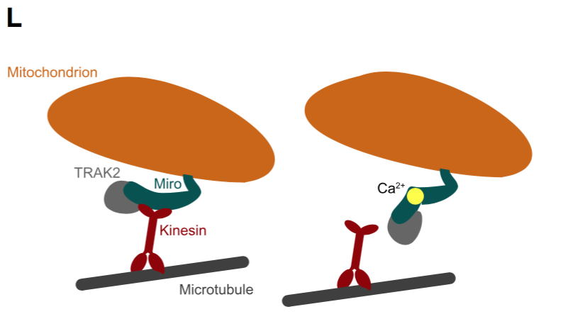

## 2015/12/20
Continued some work on bionode-obo parser. Studying for linear algebra exam.

## 2015/19/21
More studying and exam.

## 2015/19/22
- went through notebook, notes on papers
- observed QuickGO "protein annotation tab". Can't handle not working
- programmatically - thankfully QuickGO provides
- [REST web services][quickgo-rest]
- Made [bionode-quickgo][bionode-quickgo] to scratch my itch. Can now use
- QuickGO API with semantic ease through a Promise or Stream
- Small gasket pipeline which gets tsv of a given go term from quickgo, converts
- it to csv
- gasket pipeline imports and exports from dat
- exported dataset gets filtered by protein ids, 347 results down to 304 proteins
- these 33 extra results seem to be all from proteins with more than one ref, most
- have 2, some have 3
- sorting by number of refs, I retrieved `Q7TSA0`, `Q8BG51`, and `Q8BG51` as the
- top three for [GO:0047497][GO:0047497]. I also notice the first two letters of
- each ID appear to form a "prefix" of sorts - perhaps it best to filter by these
- as well.

### [GO:0047497][GO:0047497] mitochondrion transport along microtubule
**Mitochondrial Rho GTPase 2**
- _mus musculus_
  - [Q8BG51](http://www.uniprot.org/uniprot/Q8BG51)
    - Rhot1

  - [Q8JZN7](http://www.uniprot.org/uniprot/Q8JZN7)
    - Rhot2

- [Q7TSA0](http://www.uniprot.org/uniprot/Q7TSA0)
  - _rattus norvegicus_
  - Rhot2

- [H0YZL5](http://www.uniprot.org/uniprot/H0YZL5)
  - uncharactized protein
  - RHOT2

## 2015/19/23
- Observed that the first 20 or so, when checking manually by copy pasting
- from an array of IDs arranged by most-refs to least-refs, where all the
- Rot2 gene (with the exception of Rot1 also present in _mus musculus_)
- They are all the same gene!(?)
- So, using the Uniprot URI "api" and [xml2js][xml2js] and [hihat][hihat] I
- began inspecting from where to retrieve the "name" attribute:

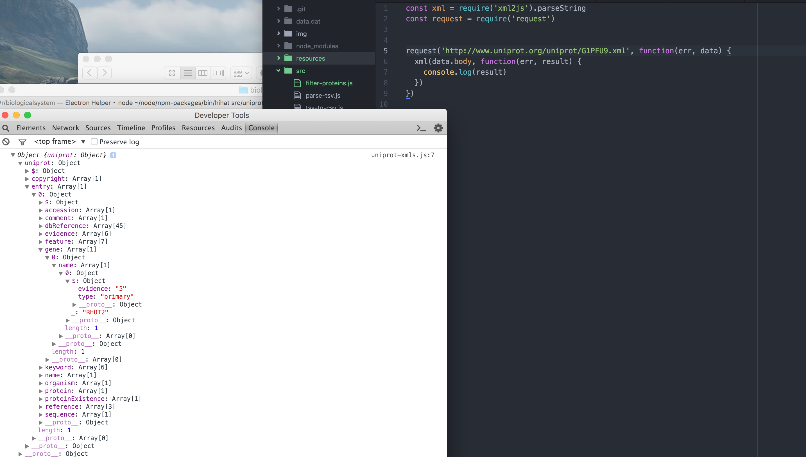
- finally got xml parsing pipeline to output "name" of gene. Would be nice
- to post-process the xmlJSON output to convert single-length arrays to
- their object..was frustrating parsing this data

```js
xmlJSON.uniprot.entry[0].gene[0].name[0]._
```

- Among the names I see RHOT2, KIF1B, MAP1B, MAPT, Miro, RHOT1, ... just
- need to remove duplicates
- filters into arrays by gene name. but pipe ends here and need to refactor
- into smaller pipeables
- sorts by size of array:

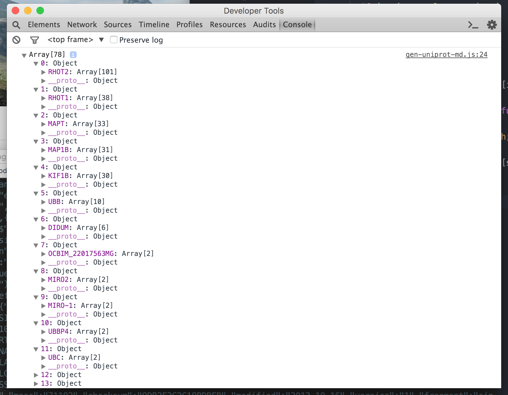

Generated [markdown files](https://github.com/thejmazz/biologicalsystem/tree/master/files) by running gasket pipeline with different GO IDs.

Some GO terms have no protein annotations!

Noted down "popular genes" from each markdown dump.

### [GO:0047497][GO:0047497] (mitochondrion transport along microtubule)
**Rhot2**

Mitochondrial Rho GTPase 2

Human: [Q8IXI1](http://www.uniprot.org/uniprot/Q8IXI1)
- Mitochondrial GTPase involved in mitochondrial trafficking. Probably involved
- in control of anterograde transport of mitochondria and their subcellular
- distribution (By similarity).
- 3 NT binding domains, then 2 calcium binding domains, then 3 NT binding domains
- 2 pubs. supporting subcellular location of
  - mitochondrion outer membrane
  - single-pass type IV membrane protein

- InInteracts with the kinesin-binding proteins TRAK1/OIP106 and TRAK2/GRIF1,
- forming a link between mitochondria and the trafficking apparatus of the
- microtubules (by similarity) [UNIPROT]
- Probably involved in control of anterograde transport of mitochondria and
- their subcellular distribution (By similarity) [STRING]

[rhot2-string](http://string-db.org/newstring_cgi/show_network_section.pl?identifier=9606.ENSP00000321971)

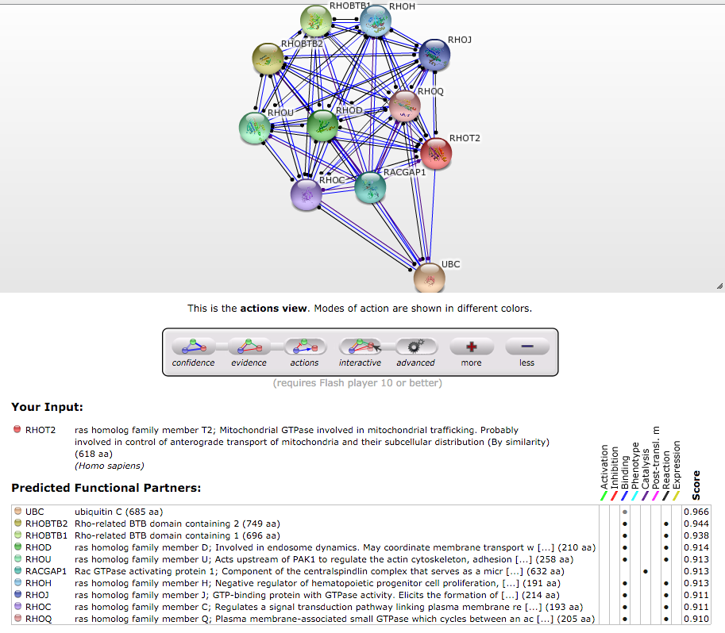 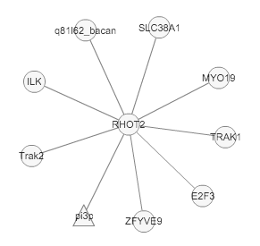

**Rhot1**

Human: [Q8IXI2](http://www.uniprot.org/uniprot/Q8IXI2)
- colocalizes with MGARP and RHOT2 at the mitochondria


**MAPT**

Microtubule-associated protein tau

Human: [P10636](http://www.uniprot.org/uniprot/P10636)
- Promotes microtubule assembly and stability, and might be involved in the establishment and maintenance of neuronal polarity. The C-terminus binds axonal microtubules while the N-terminus binds neural plasma membrane components, suggesting that tau functions as a linker protein between both. Axonal polarity is predetermined by TAU/MAPT localization (in the neuronal cell) in the domain of the cell body defined by the centrosome. The short isoforms allow plasticity of the cytoskeleton whereas the longer isoforms may preferentially play a role in its stabilization. [UNIPROT]
- in a lot of biological processes
- cytosol, cell membrane, cytoskeleton
- Interacts with PSMC2 through SQSTM1 (By similarity). Interacts with SQSTM1 when polyubiquitinated. Interacts with FKBP4 (By similarity). Binds to CSNK1D. Interacts with SGK1. Interacts with EPM2A; the interaction dephosphorylates MAPT at Ser-396. [UNIPROT]

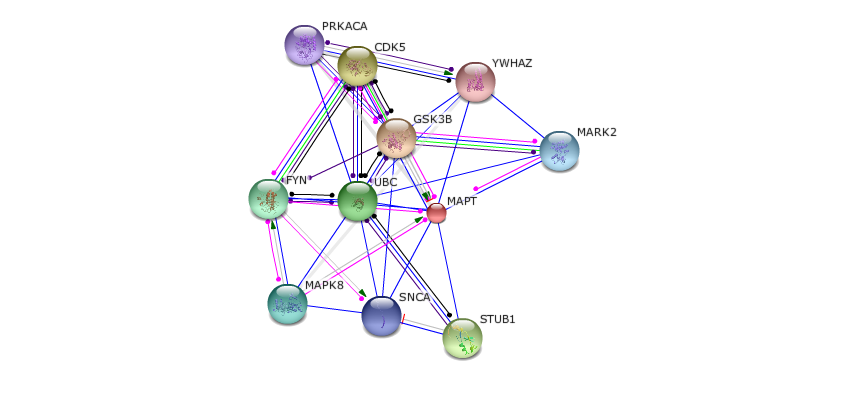

**MAP1B**

Microtubule-associated protein 1B

Human: [P46821](http://www.uniprot.org/uniprot/P46821)
- Facilitates tyrosination of alpha-tubulin in **neuronal** microtubules (By similarity). Phosphorylated MAP1B may play a role in the cytoskeletal changes that accompany neurite extension. Possibly MAP1B binds to at least two tubulin subunits in the polymer, and this bridging of subunits might be involved in nucleating microtubule polymerization and in stabilizing microtubules. Acts as a positive cofactor in DAPK1-mediated autophagic vesicle formation and membrane blebbing [UNIPROT]
- cytoplasm, cytoskeleton, synapse, dendritic spine
- 3 different light chains, LC1, LC2 and LC3, can associate with MAP1A and MAP1B proteins. LC1 interacts with the amino-terminal region of MAP1B. Interacts with ANP32A and TIAM2. Interacts with the tubulin tyrosine TTL (By similarity). Interacts (via C-terminus) with GAN (via Kelch domains). Interacts (via N-terminus) with DAPK1. Interacts with TMEM185A. Interacts with MAP1LC3B

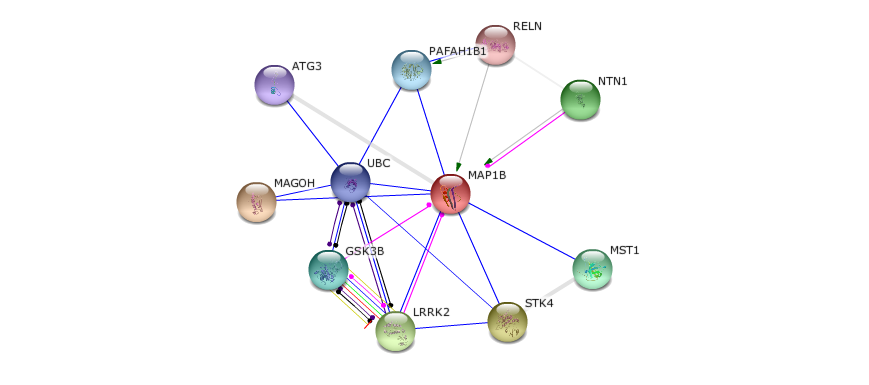

**KIF1B**

Kinesin-like protein
- Motor for anterograde transport of mitochondria. Has a microtubule plus end-directed motility. Isoform 2 is required for induction of neuronal apoptosis [UNIPROT]
- ctyoplasmic vesicle, cytoskeleton, mitochondrion
- Colocalizes with synaptophysin at synaptic cytoplasmic transport vesicles in the neurites of hippocampal neurons
- Interacts (via C-terminus end of the kinesin-motor domain) with CHP1; the interaction occurs in a calcium-dependent manner (By similarity). Interacts with KBP

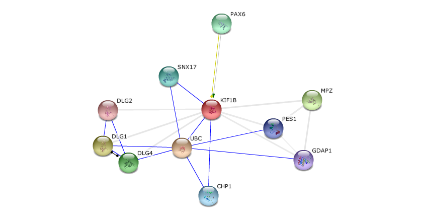

**UBB**

Polyubiquitin-B

human: [P0CG47](http://www.uniprot.org/uniprot/P0CG47)
- in a ton of processes, as expected

### [GO:0034642][GO:0034642] (mitochondrial migration along actin filament)
**AIM21**

Altered inheritance of mitochondria protein 21

Yeast: [P40563](http://www.uniprot.org/uniprot/P40563)
- Involved in mitochondrial migration along actin filaments [UNIPROT]
- cytoskeleton > actin patch
- Interacts with ribosomes. Interacts with ABP1

**Myo19**

Unconventional myosin-XIX

Mouse: [Q5SV80](http://www.uniprot.org/uniprot/Q5SV80)
- mitochondrion outer membrane

### [GO:0034643][GO:0034643] (establishment of mitochondrial localization, microtubule mediated)
- basically the same proteins as "mitochondrion transport along microtubule"

### [GO:0051654][GO:0051654] (establishment of mitochondrion localization)
**PVRL2**

Nectin-2

Human: [Q92692](http://www.uniprot.org/uniprot/Q92692)
- probable cell adhesion protein
- (Microbial infection) Acts as a receptor for herpes simplex virus 1 (HHV-1) mutant Rid1, herpes simplex virus 1 (HHV-2) and pseudorabies virus (PRV)
- annotated as 0051654 by ensemble electronic annotation

**MDM10**

Mitochondrial distribution and morphology protine 10

Yeast: [P18409](http://www.uniprot.org/uniprot/P18409)
- Component of the ERMES/MDM complex, which serves as a molecular tether to connect the endoplasmic reticulum and mitochondria. Components of this complex are involved in the control of mitochondrial shape and protein biogenesis and may function in phospholipid exchange. MDM10 is involved in the late assembly steps of the general translocase of the mitochondrial outer membrane (TOM complex). Functions in the TOM40-specific route of the assembly of outer membrane beta-barrel proteins, including the association of TOM40 with the receptor TOM22 and small TOM proteins. Can associate with the SAM(core) complex as well as the MDM12-MMM1 complex, both involved in late steps of the major beta-barrel assembly pathway, that is responsible for biogenesis of all outer membrane beta-barrel proteins. May act as a switch that shuttles between both complexes and channels precursor proteins into the TOM40-specific pathway. Plays a role in mitochondrial morphology and in the inheritance of mitochondria [UNIPROT]
- Component of the ER-mitochondria encounter structure (ERMES) or MDM complex, composed of MMM1, MDM10, MDM12 and MDM34. Associates with the mitochondrial outer membrane sorting assembly machinery SAM(core) complex, which consists of SAM35, SAM37 and SAM50, to form a SAM(holo) complex.

**MILT**

Trafficking kinesin-binding protein milt

Fly: [Q960V3](http://www.uniprot.org/uniprot/Q960V3)
- Required for kinesin-mediated axonal transport of mitochondria to nerve terminals. The oocyte acquires the majority of its mitochondria by competitive bidirectional transport along microtubules mediated by the Milton adapter. Mitochondria enter the young oocyte en mass from interconnected germ cells to generate the large aggregate known as the Balbiani body. Milt and Miro form an essential protein complex that links Khc to mitochondria for light chain-independent, anterograde transport of mitochondria [UNIPROT]
- Interacts with Miro. Note=Mitochondrial transport by milt and Khc is independent of Klc.

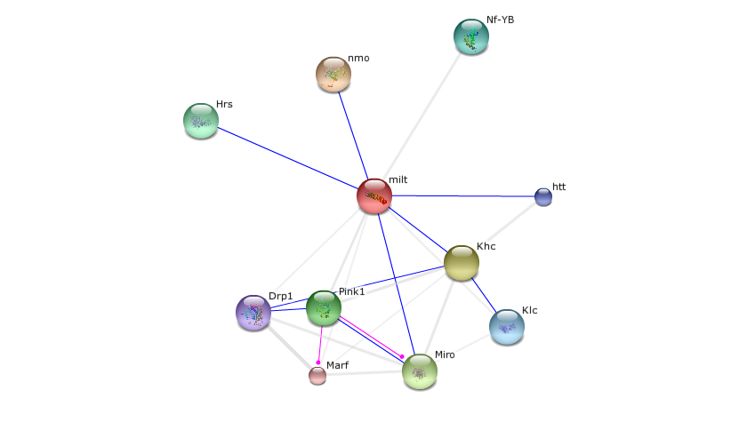

### [GO:1990456][GO:1990456] (mitochondrion-ER tethering)
**MMM1**

Maintenance of mitochondrial morphology protein 1
- Component of the ERMES/MDM complex, which serves as a molecular tether to connect the endoplasmic reticulum and mitochondria. Components of this complex are involved in the control of mitochondrial shape and protein biogenesis and may function in phospholipid exchange. The MDM12-MMM1 subcomplex functions in the major beta-barrel assembly pathway that is responsible for biogenesis of all outer membrane beta-barrel proteins, and acts in a late step after the SAM complex. The MDM10-MDM12-MMM1 subcomplex further acts in the TOM40-specific pathway after the action of the MDM12-MMM1 complex. Essential for establishing and maintaining the structure of mitochondria and maintenance of mtDNA nucleoids [UNIPROT]
- ER membrane

**MDM12**

Mitochondrial distribution and morphology protein 12

Yeast: [Q92328](http://www.uniprot.org/uniprot/Q92328)

### [GO:0051659][GO:0051659] (maintenance of mitochondrion localization)
**ALB**

Serum albumin

Human: [P02768](http://www.uniprot.org/uniprot/P02768)
- Serum albumin, the main protein of plasma, has a good binding capacity for water, Ca2+, Na+, K+, fatty acids, hormones, bilirubin and drugs. Its main function is the regulation of the colloidal osmotic pressure of blood. Major zinc transporter in plasma, typically binds about 80% of all plasma zinc. [UNIPROT]
- in a lot of processes..

**ATP2A1**

Sarcoplasmic/endoplasmic reticulum calcium ATPase 1

Human: [O14983](http://www.uniprot.org/uniprot/O14983)
- Key regulator of striated muscle performance by acting as the major Ca2+ ATPase responsible for the reuptake of cytosolic Ca2+ into the sarcoplasmic reticulum. Catalyzes the hydrolysis of ATP coupled with the translocation of calcium from the cytosol to the sarcoplasmic reticulum lumen. Contributes to calcium sequestration involved in muscular excitation/contraction. [UNIPROT]
- in a lot of processes

### [GO:0048312][GO:0048312] (intracellular distribution of mitochondria)
**CLU1**

Clustered mitochondria protein homolog

Yeast: [A0A023ZF76](http://www.uniprot.org/uniprot/A0A023ZF76)
- mRNA-binding protein involved in proper cytoplasmic distribution of mitochondria
- May associate with the eukaryotic translation initiation factor 3 (eIF-3) complex.
- RNA binding [UNIPROT]

**CLUH**

Clustered mitochondria protein homolog

Human: [I3L2B0](http://www.uniprot.org/uniprot/I3L2B0) [string](http://string-db.org/newstring_cgi/show_network_section.pl?identifier=9606.ENSP00000388872) KIAA0664 below:

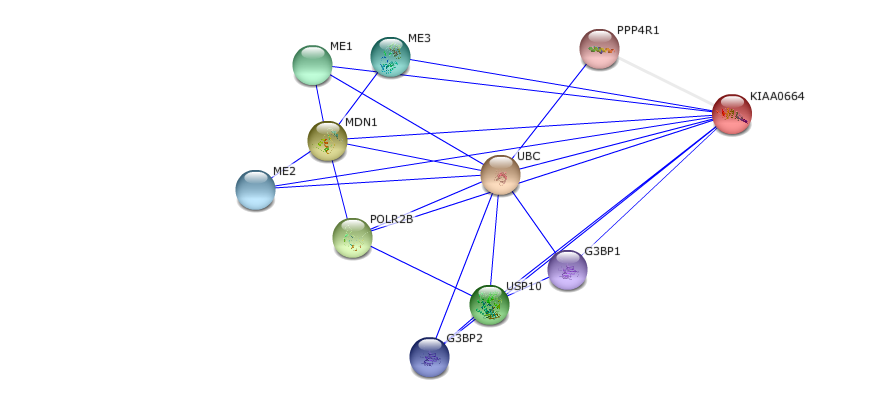

**LRRK2**

Leucine-rich repeat serine/threonine-protein kinase 2

Human: [Q5S007](http://www.uniprot.org/uniprot/Q5S007)
- Positively regulates autophagy through a calcium-dependent activation of the CaMKK/AMPK signaling pathway. The process involves activation of nicotinic acid adenine dinucleotide phosphate (NAADP) receptors, increase in lysosomal pH, and calcium release from lysosomes. Together with RAB29, plays a role in the retrograde trafficking pathway for recycling proteins, such as mannose 6 phosphate receptor (M6PR), between lysosomes and the Golgi apparatus in a retromer-dependent manner. Regulates neuronal process morphology in the intact central nervous system (CNS). Plays a role in synaptic vesicle trafficking. Phosphorylates PRDX3. Has GTPase activity. May play a role in the phosphorylation of proteins central to Parkinson disease. [UNIPROT]
- lots of processes

**BHLHA15**

Class A basic helix-loop-helix protein 15

Human: [Q7RTS1](http://www.uniprot.org/uniprot/Q7RTS1)
- Plays a role in controlling the transcriptional activity of MYOD1, ensuring that expanding myoblast populations remain undifferentiated. Repression may occur through muscle-specific E-box occupancy by homodimers. May also negatively regulate bHLH-mediated transcription through an N-terminal repressor domain. Serves as a key regulator of acinar cell function, stability, and identity. Also required for normal organelle localization in exocrine cells and for mitochondrial calcium ion transport. May function as a unique regulator of gene expression in several different embryonic and postnatal cell lineages. Binds to the E-box consensus sequence 5'-CANNTG-3' (By similarity). [UNIPROT]

**SYNJ2BP**

Synaptojanin 2 binding protein, isoform CRA_a

Human: [A0A024R670](http://www.uniprot.org/uniprot/A0A024R670)
- TM domain

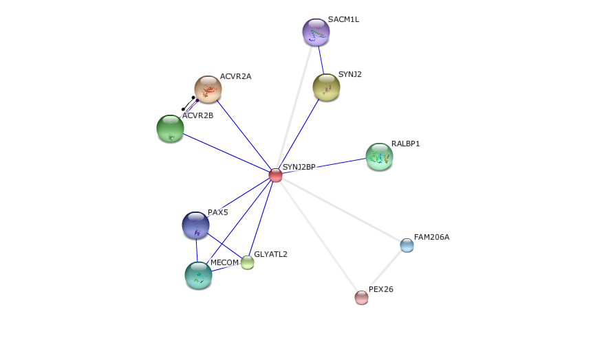

### [GO:0000001][GO:0000001] (mitochondrion inheritance)
- MDM12

**MYO2**

Myosin-2

Yeast: [P19524](http://www.uniprot.org/uniprot/P19524)

**YPT11**

GTP-binding protein YPT11

Yeast: [P48559](http://www.uniprot.org/uniprot/P48559)
- Involved in the positive control of both endoplasmic reticulum (ER) and mitochondrion inheritance during cell divison. Required for the MYO2-dependent retention of newly inherited mitochondria at the bud tip in developing daughter cells. [UNIPROT]

**MMR1**

Mitochondrial MYO2 receptor-related protein 1

Yeast: [Q06324](http://www.uniprot.org/uniprot/Q06324)
- Involved in the guiding of mitochondrial tubules to the bud tip during cell division [UNIPROT]
- Interacts with MYO2 and PCL7

**ARP2**

Actin-related protein 2

Yeast: [P32381](http://www.uniprot.org/uniprot/P32381)
- Functions as ATP-binding component of the Arp2/3 complex which is involved in regulation of actin polymerization and together with an activating nucleation-promoting factor (NPF) mediates the formation of branched actin networks. Seems to contact the pointed end of the daughter actin filament (By similarity). [UNIPROT]

### [GO:0048311][GO:0048311] (mitochondrion distribution)
**MTM1**

Myotubularin

Human: [Q13496](http://www.uniprot.org/uniprot/Q13496)
- Lipid phosphatase which dephosphorylates phosphatidylinositol 3-monophosphate (PI3P) and phosphatidylinositol 3,5-bisphosphate (PI(3,5)P2). Has also been shown to dephosphorylate phosphotyrosine- and phosphoserine-containing peptides. Negatively regulates EGFR degradation through regulation of EGFR trafficking from the late endosome to the lysosome. Plays a role in vacuolar formation and morphology. Regulates desmin intermediate filament assembly and architecture. Plays a role in mitochondrial morphology and positioning. Required for skeletal muscle maintenance but not for myogenesis. [UNIPROT]

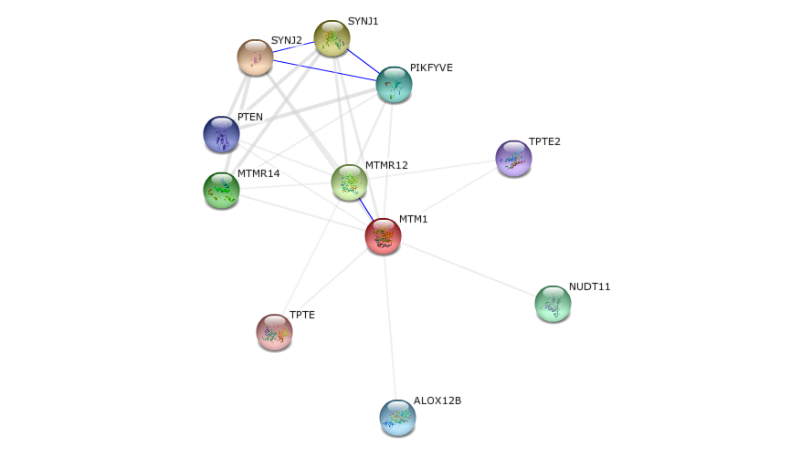

**MEF2A**

Myocyte-specific enhancer factor 2A

Human: [Q02078](http://www.uniprot.org/uniprot/Q02078)
- Transcriptional activator which binds specifically to the MEF2 element, 5'-YTA[AT]4TAR-3', found in numerous muscle-specific genes. Also involved in the activation of numerous growth factor- and stress-induced genes. Mediates cellular functions not only in skeletal and cardiac muscle development, but also in neuronal differentiation and survival. Plays diverse roles in the control of cell growth, survival and apoptosis via p38 MAPK signaling in muscle-specific and/or growth factor-related transcription. In cerebellar granule neurons, phosphorylated and sumoylated MEF2A represses transcription of NUR77 promoting synaptic differentiation. Associates with chromatin to the ZNF16 promoter. [UNIPROT]

**MSTO1**

Protein misato homolog 1

Human: [Q9BUK6](http://www.uniprot.org/uniprot/Q9BUK6)
- Involved in the regulation of mitochondrial distribution and morphology [UNIPROT]

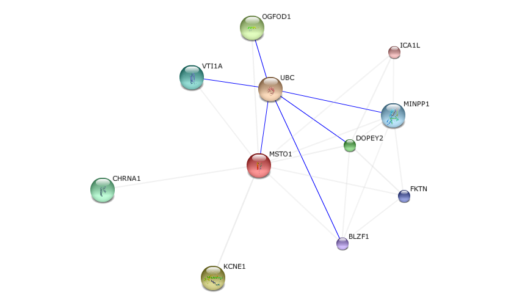

**ATCAY**

Caytaxin

Human: [http://www.uniprot.org/uniprot/Q86WG3](http://www.uniprot.org/uniprot/Q86WG3)
- Functions in the development of neural tissues, particularly the postnatal maturation of the cerebellar cortex. May play a role in neurotransmission through regulation of glutaminase/GLS, an enzyme responsible for the production in neurons of the glutamate neurotransmitter. Alternatively, may regulate the localization of mitochondria within axons and dendrites. [UNIPROT]

### Summary of first pool
I collected 28 genes from 10 GO terms on the first pass. These are,

| Gene       | Description                                           |
|:-----------|:------------------------------------------------------|
| Rhot2      | Mitochondrial Rho GTPase 2                            |
| Rhot1      | ""                                                    |
| MAPT       | Microtubule-associated protein tau                    |
| MAP1B      | Microtubule-associated protein 1B                     |
| KIF1B      | Kinesin-like protein                                  |
| UBB        | Polyubiquitin-B                                       |
| AIM21      | Altered inheritance of mitochondria protein 21        |
| Myo19      | Unconventional myosin-XIX                             |
| MYO2       | Myosin-2                                              |
| PVRL2      | Nectin-2                                              |
| MDM10      | Mitochondrial distribution and morphology protein 10  |
| MDM12      | Mitochondrial distribution and morphology protein 12  |
| MILT       | Trafficking kinesin-binding protein milt              |
| MMM1       | Maintenance of mitochondrial morphology protein 1     |
| ALB        | Serum albumin                                         |
| ATP2A1     | Sarcoplasmic/endoplasmic reticulum calcium ATPase 1   |
| CLU1, CLUH | Clustered mitochondria protein homolog                |
| LRRK2      | Leucine-rich repeat serine/threonine-protein kinase 2 |
| BHLHA15    | Class A basic helix-loop-helix protein 15             |
| SYNJ2BP    | Synaptojanin 2 binding protein, isoform CRA_a         |
| YPT11      | GTP-binding protein YPT11                             |
| MMR1       | Mitochondrial MYO2 receptor-related protein 1         |
| ARP2       | Actin-related protein 2                               |
| MTM1       | Myotubularin                                          |
| MEF2A      | Myocyte-specific enhancer factor 2A                   |
| MSTO1      | Protein misato homolog 1                              |
| ATCAY      | Caytaxin                                              |

Next steps will be to assign roles and create functional connections between these genes. Two interesting specific systems could be
- mitochondrial localization in neurons
- mitochondrial localization during cell division
- as genes from both of these specific systems have been found thus far.

## 2015/12/24
Began by annotating the above with more details, retrieved from original notes and via further inspection:

<table>
    <tbody>
        <tr>
            <th> Gene </th>
            <th> Location </th>
            <th> Functions </th>
            <th> Interactions </th>
            <th> SR </th>
        </tr>
        <tr>
            <td> Rhot2s </td>
            <td>
               [Mitochondrion outer membrane][mot], [Single-pass type IV membrane protein][tm4] ([Fransson, 2003][fransson2003])
            </td>
            <td>
              calcium ion binding, GTPase activity (InterPro), GTP binding (UniProtKB-KW)
            </td>
            <td>
              Colocalizes with **MGARP** at the mitochondria. 
              Interacts with **TRAK1** ([Fransson, 2006][fransson2006]) and **TRAK2**, forming a link b/w mitochondria and the thafficking apparatus of the microtubules (by similarity).
            </td>
            <td>
              [ID:0000007] assemble components; 
              [ID:0000019] set or [ID:0000022] integrate signals
            </td>
        </tr>
    </tbody>
</table>

[obo-format]: http://oboformat.googlecode.com/svn/trunk/doc/GO.format.obo-1_2.html
[graphql]: http://graphql.org
[graphql-draft]: http://facebook.github.io/graphql/
[quickgo-rest]: http://www.ebi.ac.uk/QuickGO/WebServices.html
[bionode-quickgo]: https://github.com/thejmazz/bionode-quickgo
[xml2js]: https://www.npmjs.com/package/xml2js
[hihat]: https://www.npmjs.com/package/hihat
[mot]: http://www.uniprot.org/locations/SL-0172
[tm4]: http://www.uniprot.org/locations/SL-9908
[fransson2003]: http://www.jbc.org/content/278/8/6495
[fransson2006]: http://www.ncbi.nlm.nih.gov/pubmed/16630562


[go:0051646]: http://www.ebi.ac.uk/QuickGO/GTerm?id=GO:0051646
[go:0051659]: http://www.ebi.ac.uk/QuickGO/GTerm?id=GO:0051659
[go:1990456]: http://www.ebi.ac.uk/QuickGO/GTerm?id=GO:1990456
[go:0051654]: http://www.ebi.ac.uk/QuickGO/GTerm?id=GO:0051654
[go:0034642]: http://www.ebi.ac.uk/QuickGO/GTerm?id=GO:0034642
[go:0034643]: http://www.ebi.ac.uk/QuickGO/GTerm?id=GO:0034643
[go:0034640]: http://www.ebi.ac.uk/QuickGO/GTerm?id=GO:0034640
[go:0047497]: http://www.ebi.ac.uk/QuickGO/GTerm?id=GO:0047497
[go:0090146]: http://www.ebi.ac.uk/QuickGO/GTerm?id=GO:0090146
[go:0090147]: http://www.ebi.ac.uk/QuickGO/GTerm?id=GO:0090147
[go:0048311]: http://www.ebi.ac.uk/QuickGO/GTerm?id=GO:0048311
[go:0048312]: http://www.ebi.ac.uk/QuickGO/GTerm?id=GO:0048312
[go:0000001]: http://www.ebi.ac.uk/QuickGO/GTerm?id=GO:0000001
